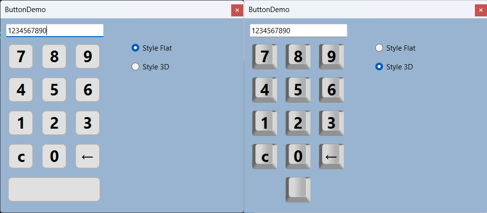

# WinForms ImageButton

Small sample button for an old ImageButton component.



Use the attached buttons (png) or create your own.

## Supported features

* Property `Image`: Image of the button
* Property `Transparent`: Transparency (determened by the color of the top-left pixel)
* Property `ClickOnHold`: Simulates long pressing a physical keyboard
* Automatic Disabled state (greyscale)
* Pushed state which will move the image and the text a bit down and right
* Pushed state based on a keyboard click

```csharp
private void Form1_KeyPress(object sender, KeyPressEventArgs e)
{
    if (e.KeyChar == '0')
    {
        Button0.PerformClick(200);
    }
}
```

You can use any button image you like. Just set the `Image` property of the button.

3D button taken from https://github.com/q2apro/keyboard-keys-speedflips (style: `single-keys-blank`)


